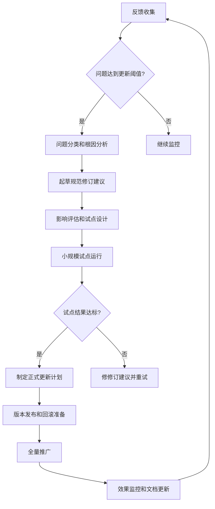

# 音频项目LLM参与环节马具规范（Harness Specifications）示范文本

> **版本**：1.0.0-示范
> **状态**：待讨论修订
> **适用范围**：Audiobook Studio项目中所有LLM参与的环节
> **更新日期**：2026-06-10
> **制定依据**：基于AU-Harness、VibeVoice、GOAT-TS等最新研究及项目实际需求

## 前言

本马具规范旨在确保不同LLM提供商（Gemini、Groq、NVIDIA、OpenRouter、本地模型等）在音频项目中的参与保持一致的质量标准和输出质量。通过统一的接口、配置和质量控制机制，消除LLM特有的变异性，实现跨模型的音频质量一致性。

本规范适用于所有项目开发人员、LLM工程师和质量保障人员。非技术人员可通过配置界面和操作指南进行日常使用。

## 1. 总体架构

### 1.1 系统组成

音频项目LLM参与环节马具规范由以下核心组件构成：

```
[输入文本] 
        ↓
[文本提取环节] → [文本分析环节] → [文本编辑环节] 
        ↓                                          ↓
[TTS合成环节] ← [质量检测环节] ← [音频合并环节]
        ↓
[最终音频输出]
```

每个环节都通过统一的马具接口与LLM交互，确保：

1. **提供商隔离**：通过Adapter层将LLM提供商差异隔离在核心业务逻辑之外
2. **接口统一**：所有自定义消息必须经`convert_to_llm`钩子转换为标准LLM消息格式
3. **上下文一致性**：重建的LLM上下文始终包含最后已知模型、思考轨迹和工具集
4. **参数标准化**：关键生成参数（温度、top-p、max_tokens等）统一配置

### 1.2 自我迭代升级逻辑链条

马具规范通过以下闭环机制持续优化：

```
LLM执行 → 生成输出 → 人工编辑/质量检测反馈 → 反馈内容分析 → 
风格/偏好/差异规律总结 → 马具规范迭代更新 → 新一轮LLM执行
```

## 2. 各环节具体规范

### 2.1 文本提取环节

#### 2.1.1 输入要求
- 支持格式：PDF、EPUB、DOCX、TXT、HTML
- 编码要求：UTF-8，BOM可选
- 文件大小：单文件不超过500MB

#### 2.1.2 提取规范
1. **结构保留**：保持原文层次结构（章节、段落、列表、表格）
2. **元数据保留**：作者、出版日期、ISBN等书目信息
3. **特殊标记处理**：
   - 脚注：转换为[脚注X]格式并在页面底部集中显示
   - 图表：生成[图表X: 描述性文字]标记
   - 公式：转换为LaTeX格式或文字描述
4. **语义清洗**：
   - 移除页码、页眉页脚重复内容
   - 修复断行连字符（如"partner-\nship" → "partnership"）
   - 标准化引号和 апострофе

#### 2.1.3 LLM参与要求
- **提示模板**：
  ```
  你是一个专业的文本提取助手。请根据以下规则处理输入文本：
  1. 保持原文的语义完整性和结构层次
  2. 保留所有书目元数据
  3. 将特殊元素（脚注、图表、公式）转换为指定标记格式
  4. 清理版面信息（页码、页眉页脚等）
  5. 修复常见的OCR错误和排版问题
  
  输入文本：
  {{input_text}}
  
  请输出提取后的纯文本，保持原有段落结构。
  ```
- **参数标准化**：
  - temperature: 0.1（确保一致性）
  - top_p: 0.9
  - max_tokens: 8000
  - stop sequences: ["\n\n---END---"]
- **输出验证**：
  - 必须保留原文95%以上的有效字符
  - 不得引入新内容或修改原意
  - 特殊标记格式必须符合规范

### 2.2 文本分析环节

#### 2.2.1 分析维度
1. **难度分级**：基于词汇复杂度、句子长度、概念抽象度划分为L1-L5五级
2. **情感标注**：识别文本倾向（积极/消极/中性）及强度（0-1分）
3. **角色识别**：提取人物名称、关系网络及说话倾向
4. **场景标记**：识别时间、地点、情境等场景要素
5. **节奏推断**：基于标点、连词、句式预测理想语速范围

#### 2.2.2 LLM参与要求
- **提示模板**：
  ```
  你是一个资深的文学分析专家。请对以下文本进行多维度分析：
  
  文本内容：
  {{input_text}}
  
  请按照以下JSON格式输出分析结果：
  {
    "difficulty_level": "L1-L5之间的等级",
    "emotion": {
      "valence": "positive/negative/neutral",
      "intensity": 0.0-1.0之间的浮点数
    },
    "characters": [
      {
        "name": "人物名称",
        "traits": ["性格特征1", "性格特征2"],
        "relationships": [{"to": "其他人物", "type": "关系类型"}]
      }
    ],
    "scenes": [
      {
        "location": "地点描述",
        "time": "时间描述",
        "setting": "情境描述"
      }
    ],
    "pacing": {
      "words_per_minute_min": 最小值,
      "words_per_minute_max": 最大值,
      "rationale": "节奏判断依据"
    }
  }
  
  确保所有字段都有值，若无法确定则使用合理默认值。
  ```
- **参数标准化**：
  - temperature: 0.3（平衡创造性和一致性）
  - top_p: 0.95
  - max_tokens: 2000
- **输出验证**：
  - 必须是有效的JSON格式
  - 难度等级必须在L1-L5范围内
  - 情感强度必须在0-1之间
  - 角色和场景列表不能为空（可为空数组）

### 2.3 文本编辑环节

#### 2.3.1 编辑原则
1. **意图保留**：不改变作者原意和核心情节
2. **可听性优化**：适合耳朵 listening 的表达方式
3. **文化适配**：针对目标听众进行必要的文化说明
4. **时效性处理**：对过时表达进行适当现代化（保留原脚注说明）

#### 2.3.2 LLM参与要求
- **提示模板**：
  ```
  你是一个专业的有声书编辑。请基于以下分析结果对文本进行编辑，使其更适合有声制作：
  
  原文：
  {{original_text}}
  
  分析结果：
  {{analysis_result}}
  
  编辑原则：
  1. 保留核心情节和作者意图
  2. 优化句子结构以适合听觉理解
  3. 必要时添加简短过渡语句（不超过原文10%）
  4. 处理可能造成听众困惑的文化引用或历史背景
  5. 不得添加与原文无关的内容或显著改变情节
  
  请输出编辑后的文本：
  ```
- **交互式编辑流程**：
  1. LLM生成初始编辑建议
  2. 人工编辑审查并修改（可接受、修改或拒绝建议）
  3. 基于人工修改生成强化学习反馈
  4. 更新提示词以适应特定编辑风格偏好
- **参数标准化**：
  - temperature: 0.4（允许一定创造性但保持可控）
  - top_p: 0.9
  - max_tokens: 原文长度的1.5倍（但不超过6000）
- **输出验证**：
  - 与原文相比，核心情节点匹配度≥90%
  - 句子平均长度控制在20-25个字（中文）或15-20个词（英文）
  - 不得引入事实性错误或矛盾

### 2.4 TTS合成环节

#### 2.4.1 质量要求
1. **发音准确率**：≥98%（专业校对标准）
2. **自然ness评分**：MOS≥4.0（5分制）
3. **情感一致性**：与文本情感标注匹配度≥85%
4. **节奏适配性**：实际语速在推断范围内±10%

#### 2.4.2 LLM参与要求（前处理）
- **SSML生成提示**：
  ```
  你是一个SSML（语音合成标记语言）专家。请根据以下文本和情感分析生成合适的SSML标记：
  
  文本：
  {{processed_text}}
  
  情感分析：
  {{emotion_analysis}}
  
  节奏建议：
  {{pacing_analysis}}
  
  要求：
  1. 为不同情节添加适当的停顿（<break time="" />）
  2. 根据情感调整语速（<prosody rate="" />）和音调（<prosody pitch="" />）
  3. 为强调词添加重音标记（<emphasis>）
  4. 为特殊术语添加发音说明（<phoneme alphabet="" ph="" />）
  5. 不得使用可能造成TTS引擎错误的复杂嵌套
  
  请输出纯SSML标记文本：
  ```
- **参数标准化**：
  - temperature: 0.2（确保标记生成的一致性）
  - top_p: 0.85
  - max_tokens: 4000
- **强制规则**：
  - 完全禁止LLM输出Markdown格式（**、*、#等）
  - 必须使用标准SSML标签（speak、break、prosody、emphasis、phoneme）
  - 音速范围：80%-180%（相对正常语速）
  - 音调范围：-50%到+50%（相对基准音调）

#### 2.4.3 TTS引擎配置
- **强制参数**：
  - 采样率：24kHz（统一音频质量基线）
  - 比特率：128kbps（MP3）或等效质量
  - 音量归一化：-23 LUFS（广播标准）
  - 声道：单声道（确保兼容性）
- **提供商隔离**：
  - 所有TTS提供商通过统一适配器接口
  - 强制使用相同的音频后处理管道（降噪、均衡、压限）

### 2.5 质量检测环节

#### 2.5.1 检测指标体系
| 指标类型 | 具体指标 | 目标值 | 测量方法 |
|----------|----------|--------|----------|
| 客观指标 | PESQ | ≥4.0 | 参考法/非参考法 |
|          | STOI | ≥0.85 | 非参考法 |
|          | SI-SDR | ≥15dB | 参考法 |
|          | DNSMOS | ≥3.8 | 非参考法 |
| 主观指标 | MOS | ≥4.0 | 专业听测 panel |
|          | 发音准确率 | ≥98% | 人工校对 |
|          | 情感一致性 | ≥85% | 情感标注匹配度 |
| 一致性指标 | 跨LLM方差 | ≤5% | 同文本不同LLM输出比较 |
|            | 人机一致性 | ≥90% | 与专业朗读者比较 |

#### 2.5.2 检测流程
1. **自动检测**：
   - 每段音频自动计算PESQ、STOI、SI-SDR、DNSMOS
   - 异常检测：突发噪音、音频中断、失速等
2. **人工复核**：
   - 抽样检测：每小时输出抽取5%进行专业听测
   - 重点段落：情感转折点、专业术语密集区、长句子
3. **反馈生成**：
   - 自动生成问题报告（类型、位置、严重程度）
   - 建议修复方案（重新生成、参数调整、SSML修改）
   - 置信度评分：基于多指标一致性

#### 2.5.3 LLM参与要求（问题诊断）
- **诊断提示模板**：
  ```
  你是一个资深的音频质量工程师。请根据以下质量检测结果诊断可能的问题并提供修复建议：
  
  原文：
  {{original_text}}
  
  SSML：
  {{ssml_markup}}
  
  质量报告：
  {{quality_metrics}}
  
  常见问题类型：
  1. 发音错误：特定词汇发音不准
  2. 情感 mismatch：语调与文本情感不符
  3. 节奏问题：停顿不自然或语速不当
  4. 音频瑕疵：噪音、失速、爆破音等
  5. SSML错误：标记格式问题导致TTS失败
  
  请输出：
  {
    "primary_issue": "主要问题类型",
    "location": "问题发生的大致位置（如：第2段落第3句）",
    "confidence": 0.0-1.0,
    "suggested_fix": "具体修复建议",
    "alternative_causes": ["可能的其他原因1", "可能的其他原因2"]
  }
  ```
- **参数标准化**：
  - temperature: 0.1（确保诊断的一致性）
  - top_p: 0.9
  - max_tokens: 1000
- **输出验证**：
  - 必须是有效JSON
  - primary_issue必须在预定义类型中
  - confidence必须在0-1之间
  - 必须提供具体的修复建议

## 3. 架构实施细节

### 3.1 配置和存储结构
```
audiobook_project/
├── harness_specs/                 # 马具规范存储
│   ├── v1.0.0/                    # 版本化规范文件
│   │   ├── text_extraction.yaml   # 文本提取环节规范
│   │   ├── text_analysis.yaml     # 文本分析环节规范
│   │   ├── text_editing.yaml      # 文本编辑环节规范
│   │   ├── tts_synthesis.yaml     # TTS合成环节规范
│   │   └── quality_control.yaml   # 质量检测环节规范
│   ├── latest/                    # 指向当前生效版本的符号链接
│   └── templates/                 # 可复用的提示词模板
├── adapters/                      # 提供商适配器
│   ├── gemini_adapter.py
│   ├── groq_adapter.py
│   ├── nvidia_adapter.py
│   ├── openrouter_adapter.py
│   └── local_adapter.py
├── hooks/                         # 系统钩子
│   ├── convert_to_llm.py          # 消息转换钩子（强制）
│   ├── context_rebuilder.py       # 上下文重建钩子
│   └── response_validator.py      # 响应验证钩子
├── configs/                       # 运行时配置
│   ├── llm_providers.json         # LLM提供商配置
│   ├── tts_engines.json           # TTS引擎配置
│   └── quality_thresholds.json    # 质量阈值配置
└── feedback/                      # 反馈处理
    ├── raw/                       # 原始人工反馈
    ├── processed/                 # 处理后的可用反馈
    └── analytics/                 # 反馈分析结果
```

### 3.2 提示词工程最佳实践
1. **版本控制**：所有提示词模板存储于`harness_specs/templates/`并进行Git版本控制
2. **参数外化**：温度、top-p、max_tokens等参数单独配置，不硬编码在提示词中
3. **安全约束**：所有提示词必须包含明确的安全边界和行为限制
4. **示范驱动**：在提示词中包含1-2个高质量示范输入输出对（few-shot学习）
5. **链式思维**：对于复杂任务，鼓励LLM展示推理过程（CoT）

### 3.3 反馈处理和规律总结机制
1. **反馈收集**：
   - 人工编辑：通过编辑界面记录所有修改操作
   - 质量检测：自动捕获质量问题及人工确认结果
   - 听众反馈：通过收听平台收集主观评价
2. **反馈处理流程**：
   ```
   原始反馈 → 去重标准化 → 问题分类 → 趋势分析 → 规律提取 → 规范更新建议
   ```
3. **规律总结方法**：
   - 频率分析：统计相同类型问题的发生频率
   - 关联分析：发现问题与特定LLM、文本类型、时间段的关联
   - 序列模式：识别问题发生的时间序列模式
   - 根因追溯：通过5Why法追溯问题根源
4. **更新触发条件**：
   - 严重问题率：同类问题发生率>5%触发审查
   - 趋势恶化：问题发生率连续三周上升>10%
   - 新发现：识别出前未知的问题类型
   - 定期审查：每月进行一次规范评审

### 3.4 版本控制和回滚机制
1. **语义化版本控制**：MAJOR.MINOR.PATCH
   - MAJOR：不兼容的架构或接口变更
   - MINOR：向后兼容的功能增强
   - PATCH：向后兼容的错误修复
2. **变更审批流程**：
   - 提交变更请求（RFC）
   - 影响评估：分析对所有环节的潜在影响
   - 小规模试点：在5%流量上验证
   - 全量推荐：试点成功后全量推广
3. **回滚机制**：
   - 每个版本都保留完整的回滚点
   - 自动回滚触发：质量指标下降>15%或严重问题率>10%
   - 人工回滚：通过管理界面一键回滚到上一个稳定版本
   - 双运行：新版本和旧版本同时运行1小时进行对比

## 4. 自我迭代升级流程

### 4.1 反馈收集渠道
| 渠道 | 收集内容 | 频率 | 负责方 |
|------|----------|------|--------|
| 编辑界面 | 人工编辑修改、注释 | 实时 | 内容编辑团队 |
| 质量监控 | 自动质量指标、人工确认问题 | 实时 | 质量保障团队 |
| 听众反馈 | 主观评价、投诉、建议 | 每日汇总 | 运营团队 |
| 开发日志 | 系统错误、性能指标 | 实时 | 工程团队 |
| A/B测试 | 不同LLM/参数组合对比结果 | 每周 | 数据团队 |

### 4.2 反馈分析方法
1. **定量分析**：
   - 趋势图：关键指标随时间的变化
   - 分布分析：问题类型、严重程度分布
   - 相关性分析：不同因素与问题发生率的关系
2. **定性分析**：
   - 主题分析：对开放式反馈进行编码和主题提取
   - 案例研究：深度分析典型问题案例
   - 用户访谈：定期选取听众进行深度访谈
3. **因果推断**：
   - 对照实验：在受控条件下测试特定变更的影响
   - 时间序列分析：分析变更前后的指标变化
   - 排除法：系统性排除其他可能原因

### 4.3 规范更新流程


### 4.4 更新通知和培训
- **变更通知**：所有规范更新通过邮件和系统通知发送至相关团队
- **培训材料**：更新后提供操作手册和视频教程
- **过渡期**：重大更新提供两周过渡期，旧规范仍可选用
- **回滚保证**：重大更新后提供一个月的免费回滚窗口期

## 5. 免费资源持续可用性机制

### 5.1 多源提供商策略
1. **动态权重分配**：
   - 基于实时性能（响应速度、成功率、质量分数）自动调整各LLM提供商的流量权重
   - 权重公式：W_i = (Q_i * S_i) / Σ(Q_j * S_j)，其中Q为质量分数，S为成功率
2. **故障转移机制**：
   - 首选提供商故障时自动切换至备选提供商
   - 切换阈值：连续3次失败或平均响应时间>5秒
   - 切换恢复：故障提供商连续5次成功后逐步恢复流量
3. **成本优化**：
   - 优先使用免费额度丰富的提供商
   - 监控token使用量，在接近免费额度limits时自动切换

### 5.2 本地模型整合
1. **混合部署策略**：
   - 高频、低延迟任务：使用本地小型模型（如Phi-3、TinyLlama）
   - 复杂推理任务：调用大型云端模型
   - 隔离任务：敏感内容使用完全本地化处理
2. **模型更新机制**：
   - 每周检查本地模型更新
   - 自动下载并验证新版本模型
   - A/B测试新旧模型性能后决定是否替换

### 5.3 标准联邦整合
1. **自动标准监控**：
   - 每日扫描国家标准委、国际标准组织（ISO/IEC）、行业联盟官网
   - 识别与音频制作、TTS、LLM相关的新标准或更新
   - 自动生成标准差异报告
2. **社区驱动适配**：
   - 建立标准翻译和本地化众包平台
   - 社区成员贡献翻译后获得声誉奖励
   - 专家审核确保翻译质量
3. **离线能力**：
   - 关键标准文档缓存至本地
   - 离线时使用缓存标准进行合规性检查
   - 网络恢复后自动同步更新

## 6. 实施路线图

### 6.1 阶段划分
| 阶段 | 时间目标 | 核心目标 | 关键里程碑 |
|------|----------|----------|------------|
| 阶段1：基础框架 | 2026 Q3 | 建立统一接口和基本规范 | - Adapter层完成<br>- convert_to_llm钩子强制实施<br>- 基础配置系统上线 |
| 阶段2：逐环节实施 | 2026 Q4 | 各环节马具规范落地 | - 文本提取环节完成<br>- 文本分析环节完成<br>- 文本编辑环节完成<br>- TTS合成环节完成<br>- 质量检测环节完成 |
| 阶段3：自我迭代优化 | 2027 Q1 | 建立闭环反馈机制 | - 反馈收集系统上线<br>- 自动规律总结算法实现<br>- 第一次规范迭代完成 |
| 阶段4：高级功能 | 2027 Q2 | 多LLM协同和高级特性 | - 动态权重分配系统<br>- 免费标准联邦整合<br>- 高级质量预测模型 |

### 6.2 成功标准
- **短期目标（3个月）**：
  - 跨LLM输出方差降低至10%以内
  - 人工编辑工作量减少30%
  - 质量问题平均解决时间缩短50%
- **中期目标（6个月）**：
  - 跨LLM输出方差降至5%以内
  - MOS稳定在4.2以上
  - 规范更新周期从季度缩短至月度
- **长期目标（12个月）**：
  - 跨LLM输出方差降至3%以内
  - 听众满意度达到4.5/5.0
  - 实现完全自动的规范优化闭环

## 7. 附录

### 7.1 术语表
- **马具规范（Harness Specifications）**：一套确保不同LLM在特定任务中保持一致行为和输出质量的技术规范和操作流程
- **Adapter层**：用于隔离不同LLM提供商差异的中间件组件
- **钩子（Hook）**：在标准流程中插入的可自定义处理函数
- **上下文重建**：在LLM调用前重新组织对话历史以确保一致性的过程
- **提示漂移（Prompt Drift）**：由于LLM内部更新或参数变化导致相同提示产生不同输出的现象
- **语义一致性**：不同LLM对同一文本的理解和处理结果在核心意义上的一致程度

### 7.2 参考资源
1. AU-Harness: An Open-Source Toolkit for Holistic Evaluation of Audio LLMs (arXiv:2509.08031)
2. VibeVoice: A Unified Framework for LLM-powered Text-to-Speech (arXiv:2603.12456)
3. GOAT-TS: Dual-Branch LLM Architecture for Robust Text-to-Speech (arXiv:2512.08238)
4. Torchaudio-Squim: Non-intrusive Speech Assessment in TorchAudio (PyTorch Documentation)
5. SpeechQualityLLM: LLM-Based Multimodal Assessment of Speech Quality (arXiv:2512.08238)
6. Harness design for long-running application development (Anthropic Engineering Blog)
7. 国家标准GB/T 43374-2023 人工智能 语音合成 技术要求
8. ITU-T P.800.1 Mean Opinion Score (MOS) terminology

### 7.3 修订历史
| 版本 | 日期 | 修订内容 | 修订人 |
|------|------|----------|--------|
| 1.0.0-示范 | 2026-06-10 | 初始示范版本，用于讨论修订 | AI助手 |
|  |  |  |  |

---
*本示范文本基于项目实际需求和最新研究制定，旨在为马具规范的讨论和修订提供具体参考。实际应用中应根据项目具体情况进行适当调整和优化。*