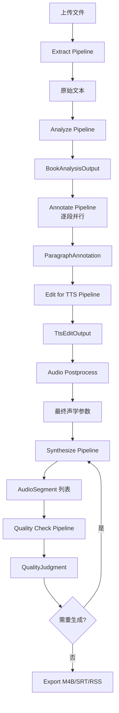

# Architecture Overview

The Audiobook Studio is built with FastAPI as the web framework, SQLAlchemy 2.0 for ORM, and SQLite as the default database. The project follows a modular structure with clear separation of concerns.

## System Architecture

```
┌─────────────────────────────────────────────────────────────────────────────────┐
│                              Audiobook Studio                                    │
├─────────────────────────────────────────────────────────────────────────────────┤
│                                                                                  │
│  ┌──────────────────────────────────────────────────────────────────────────┐   │
│  │                            API Layer (FastAPI)                           │   │
│  │  /projects  /books  /chapters  /paragraphs  /tts_edits  /routings        │   │
│  │  /qualities  /export  /config  /collab  /health                          │   │
│  └──────────────────────────────────────────────────────────────────────────┘   │
│                                      │                                          │
│  ┌──────────────────────────────────────────────────────────────────────────┐   │
│  │                         Pipeline Orchestrator                            │   │
│  │  run_stage("extract" | "analyze" | "annotate" | "edit" | "audio_post"  │   │
│  │         | "synthesize" | "quality" | "translate", ...)                   │   │
│  └──────────────────────────────────────────────────────────────────────────┘   │
│                                      │                                          │
│  ┌──────────┐ ┌──────────┐ ┌──────────┐ ┌──────────┐ ┌──────────┐ ┌───────┐  │
│  │ Extract  │ │ Analyze  │ │ Annotate │ │  Edit    │ │AudioPost │ │Synth  │  │
│  │Pipeline  │ │Pipeline  │ │Pipeline  │ │Pipeline  │ │Pipeline  │ │Pipeline│  │
│  └──────────┘ └──────────┘ └──────────┘ └──────────┘ └──────────┘ └───────┘  │
│  ┌──────────┐ ┌──────────┐                                                │    │
│  │ Quality  │ │Translate │                                                │    │
│  │Pipeline  │ │Pipeline  │                                                │    │
│  └──────────┘ └──────────┘                                                │    │
├─────────────────────────────────────────────────────────────────────────────────┤
│                                      │                                          │
│  ┌──────────────────────────────────────────────────────────────────────────┐   │
│  │                      HARNESS Three-Layer Architecture                    │   │
│  │  ┌─────────────┐    ┌──────────────────┐    ┌────────────────────────┐  │   │
│  │  │  Contract   │───▶│    Execution     │───▶│    Evaluation          │  │   │
│  │  │  (Pydantic  │    │  (Instructor +   │    │  (LLM-as-Judge +     │  │   │
│  │  │   Schemas)  │    │   LiteLLM Router)│    │   Golden Dataset +    │  │   │
│  │  └─────────────┘    └──────────────────┘    │   Feedback Loop)     │  │   │
│  │       ▲               ▲                     └────────────────────────┘  │   │
│  │       └───────────────┴──────────────────────────│                      │   │
│  │              Versioned Contracts (YAML)          │                      │   │
│  └──────────────────────────────────────────────────┼──────────────────────┘   │
│                                                     │                          │
│  ┌─────────────────────────────────────────────────┼──────────────────────┐   │
│  │                    Persistence Layer (SQLAlchemy 2.0)                    │   │
│  │  Project → Chapter → Paragraph → AudioSegment → Quality → TTSEdit...    │   │
│  │  CheckpointManager (断点续传)  |  VersionStore (快照回滚)                │   │
│  └──────────────────────────────────────────────────────────────────────────┘   │
│                                                     │                          │
│  ┌─────────────────────────────────────────────────┼──────────────────────┐   │
│  │                    Storage Layout                                            │   │
│  │  storage/books/{project_id}/                                                 │   │
│  │  ├─ raw/          # 原始输入文件                                              │   │
│  │  ├─ extracted/    # 提取后文本                                                │   │
│  │  ├─ annotated/    # 段落标注结果                                              │   │
│  │  ├─ audio/        # 合成音频片段                                              │   │
│  │  └─ reports/      # 质量报告、导出产物                                         │   │
│  └──────────────────────────────────────────────────────────────────────────┘   │
│                                                                                  │
└─────────────────────────────────────────────────────────────────────────────────┘
```

## Core Components

### 1. Pipeline Stages (7 Stages)

| Stage | Module | Input | Output | Mock Mode |
|-------|--------|-------|--------|-----------|
| **Extract** | `extract.py` | File path | `ExtractionResult` (raw_text, language, page_count, warnings) | ✅ |
| **Analyze** | `analyze_structure.py` | Text + title | `BookAnalysisOutput` (book_meta, character_voice_map, emotion_snapshots, story_line_summary, global_style_notes) | ✅ |
| **Annotate** | `annotate_paragraph.py` | Paragraph + context | `ParagraphAnnotation` (speaker, emotion, speech_rate, pitch, pauses, SFX tags) | ✅ |
| **Edit** | `edit_for_tts.py` | Text + annotation | `TtsEditOutput` (edited_text, changes_made, forbidden_removed, rationale) | ✅ |
| **Audio Post** | `audio_postprocess.py` | Annotation + voice_map | `AudioPostProcessParams` (final speech_rate, pitch, SFX tags) | ✅ |
| **Synthesize** | `synthesize.py` | TTS inputs | `AudioSegment` (file_path, duration, engine, voice_id) | ✅ |
| **Quality** | `quality_check.py` | Audio + reference | `QualityJudgment` (scores, issues, fix_suggestions, needs_regeneration) | ✅ |
| **Translate** | `translate.py` | Chapters + target_lang | Translated chapters with voice characteristic preservation | ✅ |

### 2. Data Models (SQLAlchemy 2.0)

```
Project (1) ─────< Chapter (N)
Chapter (1) ─────< Paragraph (N)
Paragraph (1) ──< AudioSegment (1)
Paragraph (1) ──< Quality (1)
Paragraph (1) ──< TTSEdit (N)
Project (1) ────< Character (N)
```

Key models in `src/audiobook_studio/models/`:
- `Project` - 书籍项目元数据
- `Chapter` - 章节层级、状态追踪
- `Paragraph` - 段落文本、标注、编辑、质量分数
- `AudioSegment` - 音频文件路径、时长、引擎、音色
- `Quality` - 多维度质量评分、问题列表
- `TTSEdit` - 编辑历史版本
- `Character` - 角色声纹绑定
- `CharacterVersion` - 角色版本快照

### 3. HARNESS Three-Layer Architecture

#### Layer 1: Contract (契约层)
- **Pydantic Schemas** - 定义每个管线阶段的输入/输出契约
- **Versioned Contracts** - `config/contract_versions.yaml` 管理版本兼容性
- **Golden Dataset** - `tests/golden/{stage}/few_shot.jsonl` 种子用例

#### Layer 2: Execution (执行层)
- **Instructor** - 结构化输出解析 + 自动重试
- **LiteLLM Router** - 多厂商路由、成本追踪、Token Budget
- **Constitutional Rules** - `config/constitutional_rules.yaml` 自我修正规则
- **Few-shot Injection** - 动态注入黄金数据集示例

#### Layer 3: Evaluation (评估层)
- **LLM-as-Judge** - 质量检测管线使用独立 Judge 模型
- **Golden Dataset Regression** - CI 自动回归所有种子用例
- **Feedback Loop** - `feedback/collector.py` 自动采集人工修改/质量判断差异
- **Promotion Gate** - 格式合规≥99% / 金数据集≥95% / 质量≥旧版102%

### 4. Storage Layout

```
storage/
└─ books/
   └─ {project_id}/
      ├─ raw/              # 原始上传文件
      ├─ extracted/        # 提取后文本 (extracted.txt)
      ├─ annotated/        # 段落标注 JSONL
      ├─ audio/            # 合成音频片段
      │   └─ ch{chapter_index}/
      │       ├─ p{paragraph_index}.mp3
      │       └─ metadata.json
      └─ reports/          # 质量报告、导出产物
          ├─ quality_report.json
          ├─ compliance_report.json
          ├─ output.m4b
          └─ output.srt
```

### 5. LLM Provider Management

`config/llm_providers.yaml` 配置：
- 20+ 提供商: OpenAI, Anthropic, Google, Groq, NVIDIA, OpenRouter, DeepSeek, Ollama, Cerebras, etc.
- 多 Key 池: `api_key_pool_env`, `key_rotation_strategy`
- 免费模型定价归零
- 阶段级路由策略 (视觉/长文本/高频/高质量)

### 6. Monitoring & Compliance

- **ComplianceMonitor** - 实时追踪 Schema 合规率、契约版本分布
- **BaselineRecorder** - 性能基线记录、回归检测
- **Cost Dashboard** - 按阶段/模型/难度分解成本
- **Alert System** - 钉钉/Slack Webhook 告警

## Data Flow



## Key Design Principles

1. **Pure Pipeline Stages** - 管线类无 DB 感知，Orchestrator 负责持久化
2. **Mock Mode Everywhere** - 所有类支持 `mock_mode=True` 实现无外部依赖测试
3. **Contract Versioning** - 每个阶段契约版本化，支持热加载和兼容性检查
4. **Checkpoint Resume** - 长任务支持断点续传，基于 `CheckpointManager`
5. **Observability First** - 所有 LLM 调用自动上报 Langfuse，成本/延迟/合规全链路可视
6. **Graceful Degradation** - 三层纵深防御: CircuitBreaker + HealthProbe + KeyPool + 启发式兜底